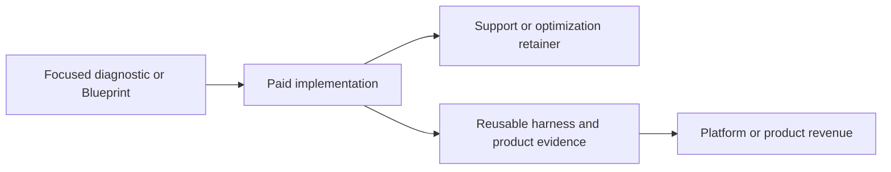

# Business model & funding

Agentic Engineering and Curia have connected founders and capabilities, but their commercial models, entities, cap tables, and raises must remain separable.

## Revenue sequence

### Agentic Engineering

1. **Focused diagnostics / Blueprints** — normally paid discovery; Multiempaques is the approved free first-client exception.
2. **Fixed-scope implementation** — milestone-priced delivery tied to a measurable operational outcome.
3. **Operate / optimize** — optional recurring support, monitoring, evaluation, and improvement.
4. **Platform and product revenue** — only after Ultimate Harness and portfolio wedges demonstrate repeatable demand and reliability.

### Curia

- Target model: paid legal-operations software and associated onboarding/support for Mexican law firms.
- Current commercial evidence: one paid design partner, KLGV, in pilot use.
- Pricing model remains a hypothesis until usage, willingness-to-pay, and support load are measured. Do not present a public price as approved without a current decision record.

## Commercial rules

- Do not offer unpaid custom work by default. The Multiempaques Blueprint exception is bounded and must produce reusable evidence.
- Do not start paid implementation before scope, price, decision-maker, and acceptance are explicit.
- Do not blend agency delivery and Curia product promises in one ambiguous contract.
- Record lead source, stage, next action, owner, expected value, confidence, and evidence in the founder ledger.

## Financing paths

| Company | Target entity | Raise | Use of funds |
| --- | --- | --- | --- |
| Agentic Engineering | Delaware corporation via Stripe Atlas | Separate AE raise | Services-to-platform growth, harness/evaluation infrastructure, selected IP portfolio, GTM |
| Curia | Mexican SAPI | Separate Curia raise | Legal-product development, security/compliance, firm onboarding, distribution |

> [!IMPORTANT]
> Entity formations, instrument terms, amounts, cap tables, and IP assignments are **not complete facts** unless supported by executed records. Investor decks must not imply otherwise.

## Raise readiness gates

Each raise needs its own:

- entity and cap table
- instrument and target amount
- use-of-funds model and runway
- IP and contract asset schedule
- customer and pipeline evidence
- market sizing with sourced assumptions
- diligence folder and claims review

A shared narrative may explain founder leverage and infrastructure synergies, but it cannot blur ownership or investor rights.

## Related

- [[articles/legal-entity-structure|Legal entity structure]]
- [[articles/claims-registry|Claims registry]]
- [[articles/founder-led-growth-operating-system|Founder-led growth operating system]]
- [[articles/portfolio-and-platform-strategy|Portfolio and platform strategy]]