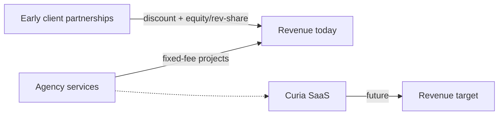

# Business model & funding

Internal canonical. Sources: [founder interview R1](../research/founder-interview-round-1-2026-06-26.md).

## Revenue streams

### Agency services (today)

- **Model:** project **fixed-fee** engagements (not primary retainer model).
- **Scope:** custom AI products, workflow automation, agent systems, infra/integration work per [public service lines](../external-sources/agenticengineering-agency-site.md).
- **Capacity gate:** 1–2 concurrent projects ([company identity](./company-identity.md)).

### Curia (future)

- **Model:** **SaaS subscription** (target; not primary revenue today).
- **Status:** in build; public launch target **16 July 2026** per [Curia overview](./curia-overview.md).
- **Entity:** intended **spinout** from agency ([company identity](./company-identity.md)).

### Early partnership economics

- Willing to structure **equity or revenue-share** with strategic early clients where it accelerates product-market fit or de-risks Curia.
- Not the default for every client — case-by-case.

## Funding

- **Self-funded** (founder capital) as of 2026-06-26.
- **Strategic investors:** Eduardo García Villanueva (KLGV) holds investor stake — see [KLGV relationship](./klgv-relationship.md).

## Pricing posture (public form vs reality)

Public inquiry form lists budgets up to **$200K+**. Internal note: validate actual closed deal sizes as engagements complete; do not assume enterprise-scale closes without evidence.

## Related

- [KLGV relationship](./klgv-relationship.md)
- [Company identity](./company-identity.md)