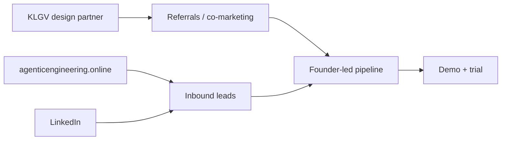

# Curia GTM & pricing playbook

Internal canonical. Sources: [R3](../research/founder-interview-round-3-2026-06-26.md), [Curia overview](./curia-overview.md).

## Pricing model (launch)

| Element | Decision |
| --- | --- |
| Model | **Per-seat SaaS** (partners / associates / firm roles — tiers TBD) |
| KLGV | **Design-partner discount** only; not free |
| Public price list | **TBD** until post–design-partner learnings |
| Services | No heavy implementation fee at launch (not 25D) |

> [!NOTE]
> Publish **value story** on `.online` before publishing numbers. First external price anchor comes after KLGV usage data.

## GTM motion (firms 2–10)

1. **KLGV referrals & co-marketing (B)** — primary warm channel in Jalisco legal network.
2. **Inbound (C)** — `.online` Spanish product site + LinkedIn thought leadership.
3. **Not primary:** cold outbound blitz, paid ads (unset — revisit post-launch).

**Founder-led sales** until ~10 firms ([support model](#support-model)).

## Launch contingency (July 16)

If slip: **soft launch to KLGV only (A)** — production for design partner; **adjust public date quietly** on `.online` / `.agency` without broad press.

Do **not** default to public delay announcement (not 27C) unless reputational need.

## Support model

- **Founders = support** until **~10 firm customers** (31A).
- **No CS hire** before Curia revenue (32A).
- Document top 10 support themes weekly during KLGV phase → informs hire #1 spec later.

## Competitive framing (Mexico)

Sell against **ChatGPT + spreadsheets** ([competitive landscape](./competitive-landscape.md)):

- Verified citations vs hallucinated articles
- Monitor → deadline → Outlook chain vs manual morning ritual

## Public subset (safe later)

- Problem, trust pillars, phased roadmap
- **Not** KLGV discount %, investor, internal seat math

## Related

- [KLGV launch playbook](./klgv-launch-playbook.md)
- [KLGV relationship](./klgv-relationship.md)
- [Public wiki boundary](./public-wiki-boundary.md)