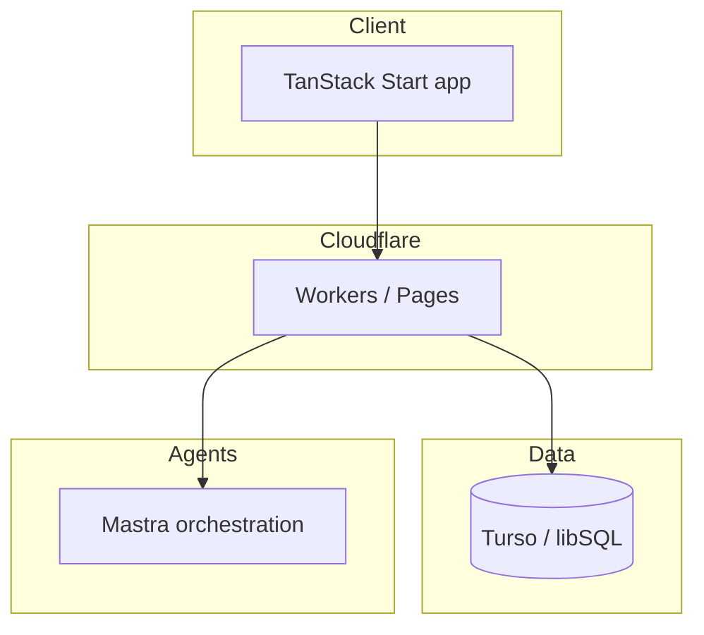

# Curia — tech stack

Internal engineering reference. Complements [product overview](./curia-overview.md).

## Stack (founder-confirmed 2026-06-26)

| Layer | Choice | Notes |
| --- | --- | --- |
| Frontend / fullstack framework | **TanStack Start** | Aligns with agency preference over Next.js |
| Deployment / edge | **Cloudflare** | Workers, Pages, edge-first |
| Database | **Turso** (libSQL) | **Not Convex** — edge-friendly SQLite model |
| Agent orchestration | **Mastra** | Workflows, tools, agent graphs for legal intelligence features |

## Related OSS in org

[agentforge](https://github.com/Agentic-Engineering-Agency/agentforge) public README mentions Mastra + Convex — **Curia production path uses Turso**, not Convex. Treat agentforge as related experiment unless explicitly merged.

## Integrations (product)

From [Curia overview](./curia-overview.md): Microsoft **Outlook** calendar sync, **Telegram** ops channel, **OneDrive** (Phase 3), citation sources (LeyesBiblio, SJF, DOF).

## Public wiki boundary

Safe later: high-level diagram (TanStack + Cloudflare + Turso + Mastra) without env/secrets.

Keep internal: schema, auth model, tenant isolation, eval pipelines.

## Related

- [Curia — product overview](./curia-overview.md)
- [Active work snapshot](./active-work.md)