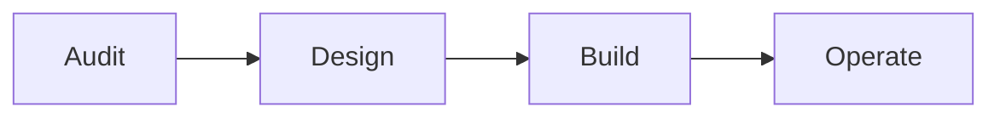

# Delivery process

How Agentic Engineering ships client work and internal product. Public mirror: [agency site process section](../external-sources/agenticengineering-agency-site.md).

## Four phases

### 1. Audit

Written diagnosis — workflow map, infra inventory, agent gap analysis. **Deliverable:** audit doc the client can keep, not slideware.

### 2. Design

**Specs before code.** Architecture, model routing, eval criteria, human-in-the-loop gates — expressed in **TypeScript types** the client's team can read.

Tools: [SpecSafe](../articles/open-source-strategy.md#specsafe) discipline where applicable.

### 3. Build

- Spec-driven implementation
- **TDD / QA gates** on AI-generated code paths
- **Weekly slices**, feature flags
- **Observability from commit one** (logging, traces, eval hooks)

### 4. Operate

- Eval frameworks and regression detection
- Alerting + model **fallback chains**
- CI/CD that catches agent regressions pre-production

## Differentiators (why our build phase is different)

From [company identity](./company-identity.md):

1. **Spec + TDD gates** on agent work — not "prompt and pray."
2. **Multi-agent orchestration** with eval/observability baked in from day one.

## Capacity constraint

We run **1–2 concurrent engagements**. Audit phase must include honest fit check — we refer out when we can't staff senior attention.

## Related

- [Company identity](./company-identity.md)
- [Open source strategy](./open-source-strategy.md)