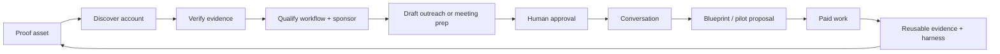

## Summary

Agentic Engineering will run a founder-led, evidence-first revenue system before scaling lead volume or building a new command-center application. The system turns proof assets and account research into qualified conversations, proposals, paid work, and reusable delivery evidence. Automation may discover, verify, score, draft, and summarize; a human approves every external send, price, proposal, scheduling commitment, CRM stage change with commercial consequences, and customer-visible claim.

The current 30-day operating window is 2026-07-26 through 2026-08-25. Its two primary lanes are Agentic Engineering agency cash generation and a separate Curia paid-pilot motion, consistent with the [portfolio and platform strategy](./portfolio-and-platform-strategy.md).

## Offer architecture

### Agentic Engineering

1. Free Workflow Fit Check.
2. Paid Agent Systems Blueprint: standard public reference US$4,000; localized Mexico access may differ by eligibility.
3. Bounded pilot: US$8,000 / US$12,000 / US$15,000 reference tiers.
4. Operations retainer: US$2,500 / US$5,000 monthly reference tiers.

Pricing references come from current Sites and Linear evidence, not a blanket promise for every geography or scope [source](../external-sources/sites-portfolio-snapshot-2026-07-26.md).

### Curia

Curia has its own narrow law-firm pilot and SaaS motion. It does not inherit the agency offer ladder. Curia pricing, contracting, governance, evidence, and fundraising remain separate; see [Curia GTM and pricing](./curia-gtm-pricing-playbook.md).

### Multiempaques exception

- Wait for sufficient operating data.
- The gate record must name the received-data manifest, baseline and measurement method, missing fields, owner, approver, and timestamp.
- Deliver the Blueprint free as a one-time early-client validation exception, with explicit deliverables, exclusions, and end condition.
- Start the 7–10-day pricing window only when the recorded data-completeness gate is met.
- Present a pricing packet after the Blueprint with paid scope, price logic, acceptance criteria, acceptance authority, and expiry.
- Start paid implementation only after explicit acceptance.
- If the gate remains incomplete at week end, close the weekly work item and return the engagement to waiting; do not imply that the relationship is lost or that the pricing clock started.
- Record the exception so it does not silently reset the standard Blueprint price.

## Revenue workflow

### Qualification gates

An account becomes qualified only when the ledger contains:

- a recurring, costly workflow;
- a decision owner;
- a credible technical or operational sponsor;
- evidence that relevant data and systems can be accessed lawfully;
- a plausible outcome worth at least three times the proposed engagement;
- a defined next action and owner.

If a required field is unknown, store `unknown`; do not ask a model to infer it.

## Weekly cadence

| Day | Founder outcome | Agent support | Required record |
| --- | --- | --- | --- |
| Monday | Choose one ICP, one offer, and 15–50 named accounts | Discover, verify, dedupe, score | Account evidence envelopes |
| Tuesday | Approve top account briefs and outreach drafts | Draft personalized messages and Fit Check paths | Approval/rejection and edit distance |
| Wednesday | Conduct calls and capture workflow evidence | Meeting prep, transcript summary, objection tagging | Conversation, pain, sponsor, next action |
| Thursday | Build proposals and follow-up assets | Requirement traceability, option drafting, claims review | Proposal amount, decision gate, follow-up date |
| Friday | Review funnel, cash, delivery risk, and experiments | Aggregate metrics and exceptions | Weekly founder ledger and next-week decision |

No send or publish occurs solely because the calendar reached a cadence step.

## Week-zero bootstrap — 2026-07-27 through 2026-08-02

This is an evidence-packet week, not a send week. Gmail remains blocked, no approved alternate outbound channel is recorded, the AE 50-account batch is not yet accepted, Curia readiness gates remain open, and Multiempaques has not passed the sufficient-data gate.

| Day | Agentic Engineering | Curia | Required gate |
| --- | --- | --- | --- |
| Monday | Freeze one commercial wedge, segment, disqualifiers, ledger owner/location, stage exits, and WIP limits. Define Multiempaques sufficient-data fields, formats, owner, approver, and timestamp. | Lock research-only posture, allowed pilot/non-production wording, and public pricing as TBD. | Founder decision record |
| Tuesday | Verify company-level public evidence toward a frozen 50-account set; record source, observed date, confidence, duplicates, and anti-fit. No named-person enrichment yet. | Build public-source evidence toward 25 firms, including workflow fit, privacy constraints, and warm-intro path. | Evidence completeness report |
| Wednesday | Review source-link validity, evidence density, reviewer effort, and qualified yield. Hold an internal founder gate. | Reconcile readiness, privacy, and claims gaps; draft replacement language for unapproved claims. | Continue/stop decision |
| Thursday | Draft segment-level first touch, follow-up, discovery, and proposal templates. Build only the portions of the Multiempaques Blueprint supported by received data. | Draft discovery questions, demo narrative, pilot measurement/support plan, and clearly labeled pricing hypotheses. | Draft-only packet |
| Friday | Review one AE approval packet; keep contradictory claims and blocked channel visible. | Finish claim inventory and corrected-copy drafts. External contact remains stopped. | Human disposition |
| Saturday | Red-team sources, privacy, claims, opt-out handling, duplicates, response ownership, and ledger destination. | Remove unconsented KLGV detail; red-team production, compliance, pricing, and support claims. | Adversarial review record |
| Sunday | Report evidence metrics and `not_configured` commercial actuals; start Multiempaques day count only if the gate timestamp exists. | Record readiness classification and whether the next week stays research-only. | Weekly decision record |

The smallest approval packet contains: entity and segment boundary; account/company rows with public provenance; an atomic claims sheet; exact first-touch/follow-up/CTA drafts; human approver and channel state; opt-out, reply, and meeting owners; ledger destination; and explicit stop conditions.

Do not report revenue, cash, pipeline value, or conversion actuals as zero while authoritative sources are unconfigured. Use `not_configured`. AE may reach a future send gate only after the frozen batch reaches at least 90% required-field completeness and 95% reviewed source-link validity, duplicates/anti-fit are removed, reply/meeting/opt-out handling is ready, an authoritative ledger exists, a channel is working and approved, and a founder approves the exact batch.

For the first 50-company falsification batch, use a provisional segment threshold of at least 15 companies with a direct observable trigger tied to the frozen wedge. If fewer than 15 pass, stop expansion, create no second batch, and reframe the wedge once from the completed evidence. This is an internal experiment threshold, not a forecast or universal benchmark.

## 30-day allocation

### Primary lane: Agentic Engineering agency

- Complete the Multiempaques sufficient-data gate and free Blueprint; start its 7–10-day pricing clock only when that gate is recorded.
- Validate one 50-account segment before considering a 500-account expansion.
- Optimize for qualified decision-owner conversations, priced proposals, and prepaid work, but do not present desired counts as forecasts until a live baseline exists.
- Use the Fit Check, Field Notes, and Proof Foundry only where their CTA, availability, and claims have been verified.
- MemSWE and Prism may support private conversations as owner-controlled proof artifacts; they are not acquisition entry points until a public, claims-reviewed CTA exists.

### Primary lane: Curia

- Re-verify KLGV pilot evidence, live privacy wording, and production gaps.
- Define one narrow pilot outcome and prepare research for a second design partner.
- Treat another paid design partner as a desired outcome, not current traction or a forecast.
- Do not contact or commit a new pilot until claims, product-readiness, privacy, and commercial gates are approved.

### Bounded validation gates

- PriceGenius: establish chain of title, one buyer, one measurable pricing workflow, a safe demo specification, and a credible paid signal before major build.
- Ultimate Harness: own one canonical evaluation corpus, strong baselines, provider-family-aware review, and a promotion decision before platform-superiority claims.
- Defade: re-verify the live revision, checkout, support, and analytics; select one segment and one offer; set numeric conversion thresholds only after a baseline exists.
- Muta: no additional build until ownership, product state, buyer, and customer evidence are reconciled and founders approve the next test.

## Funnel stages

| Stage | Entry rule | Exit evidence |
| --- | --- | --- |
| Researched | Account and provenance exist | ICP fit scored |
| Qualified | Workflow, owner, sponsor, access, and value gate pass | Human approves contact |
| Contact-ready | Draft is evidence-grounded and approved | Message sent by authorized human/system |
| Conversation | Two-way response or meeting | Pain, decision process, and next action recorded |
| Solution fit | Bounded outcome and data/access assumptions agreed | Blueprint or pilot proposal approved |
| Proposal | Scope, price, expiry, and decision date delivered | Accepted, rejected, or explicit follow-up |
| Won | Payment or binding order received | Delivery handoff complete |
| Learned | Outcome and loss/win reasons captured | Evidence feeds offer and harness updates |

A list of leads is not pipeline until stage, owner, last touch, and next action are current.

## Founder operating ledger

The ledger is the contract for the future daily-driver dashboard.

| Object | Required fields |
| --- | --- |
| Account | stable ID, company, ICP evidence, owner, source, stage, last touch, next action |
| Evidence | atomic claim, source URL/path, observed date, snippet, confidence, allowed use |
| Contact | role, public/provided contact channel, consent or lawful-use basis, account link |
| Opportunity | offer, amount/currency, probability, decision date, blocker, owner |
| Touch | draft/approved/sent state, channel, timestamp, outcome, human approver |
| Workstream | Linear issue/project, owner, expected outcome, blocker, next milestone |
| Cash | invoiced, collected, due, expected delivery cost, currency |
| Agent run | mission, model/route, prompt version, cost, latency, result, acceptance, artifact |
| Decision | decision, owner, date, evidence, review date, superseded-by link |

### Source-of-truth rule

- CRM owns accounts, contacts, and touches. Opportunity authority follows the temporal rule below: it is `not_configured` before activation, the activated private Git ledger is sole temporary authority before an accepted AE-370 cutover, and the selected proved CRM is authority after cutover.
- Linear owns work and delivery status.
- The wiki owns claims, decisions, playbooks, and evidence policy.
- Finance ledger owns cash and runway.
- Agent run ledger owns model cost and output acceptance.
- Calendar and email are read surfaces; they do not replace CRM records.
- The dashboard reads these systems and should not silently become a second write authority.

Twenty is the current working mirror for confirmed contacts in the landing-page plan, pending the open CRM architecture decision in AE-370 [source](../external-sources/linear-operating-snapshot-2026-07-26.md). Older HubSpot work remains operationally superseded unless that decision authorizes a migration. Gmail remains unavailable until OAuth is repaired; Paperclip is excluded until remote health returns [source](../external-sources/chronicle-and-runtime-snapshot-2026-07-26.md).

### Provisional opportunity-ledger authority decision

These controls are **specified only**. No repository, schema, validation, manifest, protected-write policy, adapter, rejected-write proof, or enforcement exists now.

#### Temporal authority

The required per-entity and per-object `authority_state` enum is `not_configured`, `git_authoritative`, or `crm_authoritative_git_frozen`. Only `not_configured` → `git_authoritative` → `crm_authoritative_git_frozen` is a valid forward sequence. Rollback requires a new explicit authority decision.

- **`not_configured`:** applies until a new clean private repository, schema, validation, machine-readable activation manifest, protected-write policy, and explicit founder activation decision all exist. No opportunity source is authoritative.
- **`git_authoritative`:** requires explicit founder activation. Only opportunity state may use the temporary authority below; Twenty remains a contact mirror, not opportunity authority. Accounts, contacts, touches, cash, communications, and direct PII are outside the temporary ledger's authority.
- **`crm_authoritative_git_frozen`:** requires an accepted AE-370 cutover, valid rejected-write proof, and independently reconciled frozen Git evidence. The selected and proved durable CRM owns opportunity state; Git is evidence only.

The provisional authority is a private Git-native, schema-validated JSON registry in a **new clean private repository**, scoped to opportunity state only. Activation is explicit per entity and object; neither a record nor a manifest may self-authorize outside these rules.

#### Allowlisted opportunity records

Records use strict machine fields only:

- `schema_version`; `vocabulary_version`; `record_version`; immutable `opportunity_id` with an `ae-*` or `curia-*` prefix; `entity_scope`; and `opportunity_kind` (`commercial` or `fundraising`);
- `lifecycle_state`; controlled `stage`; `amount_state`; integer `amount_minor`; ISO `currency`; controlled `confidence`; opaque `owner_ref`; enum `next_action_type`; `next_action_due_on`; and enum `blocker_codes`;
- opaque `account_ref`; exactly one applicable reference between `offer_ref` for commercial opportunities and `raise_ref` for fundraising opportunities;
- typed `evidence_refs`; `approval_state`; opaque `approver_ref`; `changed_at`; and `previous_record_sha256`.

No unconstrained free text is allowed. Names, emails, phones, message bodies, snippets, contact-bearing URLs, investor-person data, and other direct PII are prohibited. Each typed evidence reference contains only allowlisted fields such as `system` enum, opaque `record_id`, `observed_at`, `content_sha256`, and `allowed_use`; it contains no raw snippet or direct contact URL.

`vocabulary_version` selects versioned allowlists for `lifecycle_state`, `stage`, `confidence`, `amount_state`, `approval_state`, `next_action_type`, `blocker_codes`, `evidence_refs.system`, and `evidence_refs.allowed_use`. An unknown vocabulary version or value fails validation.

#### Validation and activation

Validation extends beyond JSON Schema and must enforce:

- filename, ID prefix, entity, and repository-scope agreement; global ID uniqueness;
- `record_version` increments of exactly one and a matching prior digest in `previous_record_sha256`;
- permitted stage transitions; amount/currency coupling; and owner, action, and date on active records;
- tombstones instead of deletion; no cross-entity reference or aggregation;
- recursive PII and secret scanning plus versioned evidence-system and allowed-use allowlists;
- deterministic per-entity index, count, and digest generation.

A per-entity and per-object machine-readable manifest, for example `authority.json`, contains `activated`, `activated_at`, `activated_by_ref`, `authority_scope`, `entity_scope`, `opportunity_kind` or `object_type`, `policy_version`, `vocabulary_version`, `dataset_commit`, `prior_authority`, and required enum-only `authority_state`; generic `status` is not an authority field. `not_configured` requires `activated: false`. `git_authoritative` requires `activated: true`, `activated_at`, `activated_by_ref`, and explicit founder activation. `crm_authoritative_git_frozen` requires `activated: true`, accepted AE-370 cutover, a valid rejected-write proof, and independent per-entity reconciliation. Missing, malformed, invalid-transition, or contradictory combinations fail closed to `not_configured` with an error and never yield zero. The manifest cannot self-authorize.

Dashboard configuration pins `activation_commit` out-of-band; that commit contains the authority manifest. The manifest's `dataset_commit` identifies the immutable opportunity-data snapshot. The dashboard verifies both commits and their relationship; they may differ. No commit is required to contain its own SHA. A valid authoritative state plus a healthy source and empty records may yield zero only when the metric definition permits a valid zero.

AE and Curia use distinct repositories or databases by default. Directories in one repository are not access control and are acceptable only after an explicit identical-access decision. Commercial and fundraising opportunities remain distinct collections or kinds. AE and Curia raises, customers, revenue, and opportunities are never blended or aggregated, and investor-person data is never stored.

#### Future enforcement requirements

Protected branches, required CI validation, review and tombstone policy, signed or tagged freezes, read-only credentials, rejected-write tests, and dashboard adapters are future implementation requirements. Local pre-commit checks would be advisory only. None exists now.

A rejected-write test must produce a machine-readable proof record containing `frozen_commit`, `enforcement_policy_version`, `attempted_write_at`, enum `attempted_operation`, `rejection_code`, opaque `proof_ref`, and `proof_sha256`. It contains no PII, secret, raw request, or direct storage URL.

#### Conditional no-dual-authority cutover

AE-370 must select and prove the durable destination; this decision does not precommit to Twenty. The required sequence is:

1. In `git_authoritative`, Git remains the sole opportunity authority while Twenty remains contact-mirror-only.
2. AE-370 proves the destination Opportunity object, stage history, export/read stability, and entity separation.
3. Freeze each entity ledger at a named signed or tagged commit and produce a valid typed rejected-write proof.
4. Import while the destination is non-authoritative. Preserve every `ae-*` or `curia-*` continuity ID in `external_source_id` or an immutable mapping artifact.
5. Independently reconcile IDs, counts, stages, amounts, currencies, and digests per entity. If validation fails, discard the import and Git remains authoritative.
6. Only after valid proof and reconciliation, one manifest change sets `authority_state` to `crm_authoritative_git_frozen` at an explicit effective time; dashboard configuration pins that manifest's `activation_commit` out-of-band and switches adapters without unioning sources.
7. Git remains frozen evidence-only. Rollback requires a new explicit authority decision.

## Daily-driver dashboard contract

The future Lalo/Lucy view should answer, in one screen:

1. What needs a founder decision today?
2. Which accounts need a next action?
3. Which opportunities changed stage, amount, or risk?
4. What agents completed, failed, or need review overnight?
5. Which delivery work is blocked?
6. What cash was collected, is due, or is at risk?
7. Which claims or customer evidence expire or conflict?
8. Which three outcomes matter today?

Build the UI only after the ledger can produce these answers without manual reconciliation.

## Metrics

### Leading

- accounts with verified evidence;
- qualified-account rate;
- draft acceptance and edit distance;
- founder minutes per accepted draft;
- conversations booked;
- proposals delivered;
- next-action hygiene;
- cost per accepted artifact.

### Lagging

- replies and meetings;
- proposal acceptance;
- prepaid revenue and collection time;
- gross contribution by engagement;
- pilot-to-retainer conversion;
- retention, expansion, and churn once recurring cohorts exist.

## Governance

- No invented personalization, customer metric, quote, or production claim.
- No autonomous send, publish, schedule, price change, contract acceptance, or customer-visible CRM write.
- No model handles untrusted browsing and external writing in one uninterrupted authority path.
- High-value artifacts receive fresh different-family review.
- Every exception is recorded with owner, reason, expiry, and review date.
- Stale data is labeled rather than silently treated as current.

## References

- [Operating state and revenue sequencing](../research/operating-state-and-revenue-sequencing.md)
- [Linear operating snapshot](../external-sources/linear-operating-snapshot-2026-07-26.md)
- [Founder interview — Round 4](../research/founder-interview-round-4-2026-07-26.md)
- [Delivery process](./delivery-process.md)
- [Ideal client profile](./ideal-client-profile.md)
