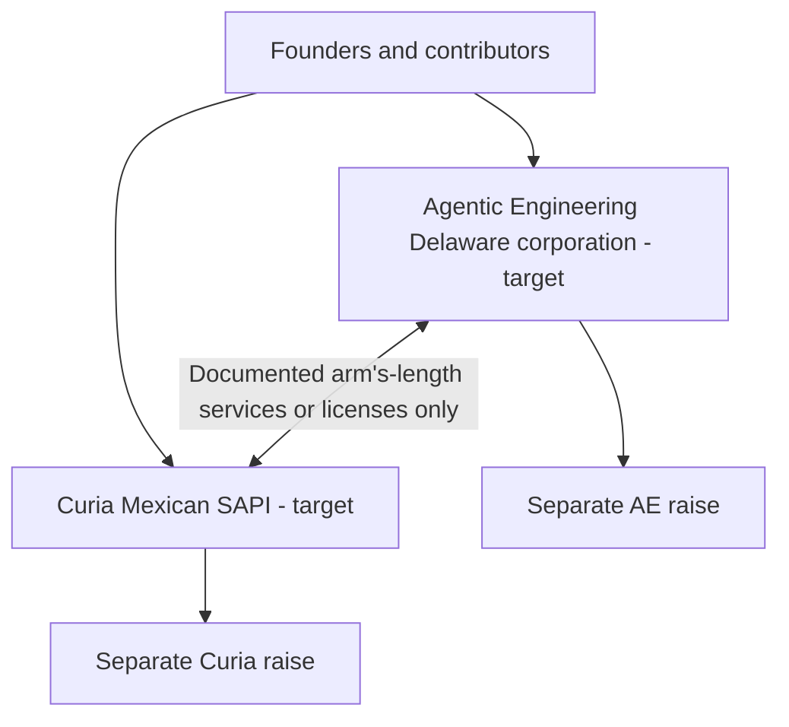

# Legal entity structure

Internal planning record, not legal advice and not public marketing copy.

## Approved target structure

| Entity | Target jurisdiction/form | Intended scope | Financing |
| --- | --- | --- | --- |
| Agentic Engineering | Delaware corporation via Stripe Atlas | Agency, multi-model platform, selected product IP | Separate AE raise |
| Curia | Mexican SAPI | Curia product, customer contracts, Curia IP | Separate Curia raise |

These are approved targets. Until filings, bank/tax setup, contracts, and assignments are executed, describe them as **planned** or **in formation**, not existing.

## Chain-of-title workstream

Create an asset schedule for every candidate AE asset:

| Asset | Intended destination | Required evidence |
| --- | --- | --- |
| Ultimate Harness | AE | Repo identity, contributors, licenses, invention/IP assignment |
| PriceGenius | AE | Same, plus customer/data rights |
| Defade | AE | Same, plus brand/domain ownership |
| Muta | Possible AE | Founder decision + full diligence |
| Agentforge | Possible AE | Name/repository resolution + full diligence |
| SpecSafe | Possible AE | Open-source licenses, contributor rights, trademark/product boundary |
| Curia | Curia SAPI | Separate code/data/contracts/IP schedule |
| ShesMine prior entity/assets | Diligence and disposition decision pending | Inventory contracts, IP, liabilities, domains, contributors, licenses, and any relationship to current AE assets |

No wiki statement itself transfers IP.

## Required separation

- Separate cap tables, investment instruments, bank/tax records, and data rooms.
- Separate customer contracts and privacy/data-processing obligations.
- Written services, license, or cost-sharing agreement for shared infrastructure or staff.
- Clear rules for improvements created during cross-entity work.
- Board/founder approvals for any transfer, exclusive license, or related-party transaction.

## Current evidence status

The current knowledge base does not establish completed AE incorporation, completed Curia SAPI registration, complete cap tables, executed assignments, or final financing instruments. Historical founder-name contracting may exist, but every active agreement must be inventoried rather than assumed.

## Completion gates

- [ ] Counsel confirms AE and Curia formation paths.
- [ ] Founder, advisor, employee, and contractor roles/cap-table rights are reconciled.
- [ ] IP and contract asset schedules are complete.
- [ ] Assignments and intercompany agreements are executed.
- [ ] Each raise has a separate claims-approved data room.
- [ ] Public sites use only the entity names and statuses supported by records.

## Related

- [[articles/company-identity|Company identity]]
- [[articles/business-model|Business model and funding]]
- [[articles/claims-registry|Claims registry]]