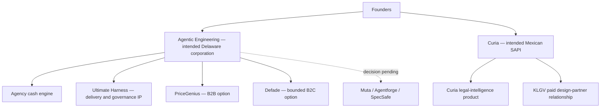
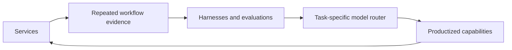

## Summary

Agentic Engineering and Curia are separate company and financing theses. Agentic Engineering is the agency-to-platform company: services generate cash and workflow evidence; Ultimate Harness and related orchestration/evaluation assets become reusable delivery IP; PriceGenius and Defade are owned product options; Muta, Agentforge, and SpecSafe may enter the perimeter after explicit decisions. Curia is a separate Mexican legal-intelligence company with its own entity, product, customers, and raise [decision record](../research/founder-interview-round-4-2026-07-26.md).

> [!WARNING]
> This page records approved target state. It does not prove that either entity has been formed or that IP, contracts, domains, repositories, or trademarks have been legally assigned.

## Company architecture

## Decisions

### Separate entities and raises

- Agentic Engineering will pursue a separate raise from Curia.
- Agentic Engineering is intended to become a Delaware corporation through Stripe Atlas.
- Curia is intended to become a Mexican SAPI.
- Curia is not an Agentic Engineering feature or internal product line.
- Shared infrastructure, founder services, and licenses between the companies must be documented rather than implied.

See [legal entity structure](./legal-entity-structure.md) for the diligence checklist and [Curia product overview](./curia-overview.md) for the separate product lane.

### Intended Agentic Engineering IP perimeter

Agentic Engineering intends to own and use Ultimate Harness, PriceGenius, and Defade IP. Muta, Agentforge, and SpecSafe are possible additions, not completed assignments. The company must maintain an asset schedule covering repositories, domains, trademarks, datasets, customer agreements, vendor agreements, licenses, and founder inventions.

### Portfolio roles

| Asset | Canonical role | Near-term proof gate |
|---|---|---|
| Agency | Immediate cash engine and customer-discovery surface | Prepaid engagement from a qualified recurring-workflow buyer |
| Multiempaques engagement | First-client validation exception | Free Blueprint after sufficient data; price 7–10 days later; implementation after acceptance |
| Ultimate Harness | Delivery, orchestration, evaluation, and governance IP; possible workshop offer | Five interviews and one paid governance/onboarding workshop |
| PriceGenius | B2B pricing-intelligence option | Eight seller interviews, two manual audits, one paid pilot |
| Defade | Bounded B2C restoration option | Verified funnel plus five paid packs before broad rebuild |
| Muta | Incubated control-plane option | Three strong customer commitments before more product build |
| Prism Arena / MemSWE | Proof, evaluation, and lead-generation assets | Qualified conversations attributable to buyer-facing proof pieces |
| Curia | Separate flagship vertical company | Additional paid pilot/design partner with governance evidence |

The repository portfolio is much larger than the active seven-day development surface [source](../external-sources/github-org-snapshot-2026-07-26.md). Portfolio membership therefore does not imply equal staffing, GTM priority, or investor prominence.

## Platform thesis

Agentic Engineering’s platform compounds through this loop:

The strategic category is comparable to multi-agent development and execution systems such as Factory, Amp, Devin, Manus, OMO, OMP, and ensemble research such as Sakana-style systems. These are category references, not parity claims.

The approved ambition is for task-specific multi-model routing to outperform any individual route on the tasks the harness validates. The company will not claim general or universal superiority before workflow-specific evaluation and real production results.

## Rationale

- Separate raises make customer, IP, economics, use-of-funds, and milestones legible to investors.
- Agency cash and customer access create shorter feedback loops than building the platform in isolation.
- Ultimate Harness and Muta are closer to the agency’s delivery architecture than Curia is.
- Bounded options preserve PriceGenius and Defade upside without allowing them to dilute the immediate cash and Curia lanes.
- Evidence-gated productization converts experience into defensible operating IP instead of a collection of unrelated repositories.

## Trade-offs

- Two entities add legal, accounting, governance, and intercompany-contract overhead.
- Concentration reduces visible progress across the long tail of projects.
- Services can distract from platform compounding unless each engagement produces reusable evidence, harnesses, and product decisions.
- Keeping the superiority claim evidence-gated produces a quieter pitch today but a stronger diligence position later.

## Alternatives considered

- One blended AE/Curia entity and raise: rejected because it obscures customer, regulatory, product, and investor theses.
- Curia as an AE feature: rejected because Curia has its own vertical product, legal obligations, customer motion, and financing needs.
- Equal portfolio priority: rejected because repository and deployment activity is not customer demand.
- Platform-first without services: rejected because it delays revenue and removes the primary source of workflow evidence.
- “Best model” selection by generic benchmark: rejected because the local benchmark is narrow and sales tasks require a dedicated harness.

## Implementation notes

1. Form and capitalize each entity; index documentary evidence.
2. Complete founder invention, confidentiality, and IP assignments.
3. Build the asset/contract/domain/repository ownership schedule.
4. Define intercompany licenses and shared-service terms.
5. Separate fundraising data rooms, cap tables, instruments, milestones, and use-of-funds plans.
6. Route all platform and customer claims through the canonical claims policy.
7. Review this strategy when a product passes or fails its evidence gate.

## References

- [Founder interview — Round 4](../research/founder-interview-round-4-2026-07-26.md)
- [Operating state and revenue sequencing](../research/operating-state-and-revenue-sequencing.md)
- [GitHub organization snapshot](../external-sources/github-org-snapshot-2026-07-26.md)
- [Business model and funding](./business-model.md)
- [Company identity](./company-identity.md)
