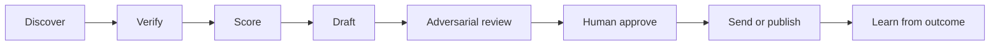

## Question

How should Agentic Engineering combine frontier models for sales and marketing work without turning the system into an expensive, unverifiable swarm?

## Sources cited

- [Prism SceneSpec benchmark snapshot](../external-sources/prism-scenespec-snapshot-2026-07-26.md)
- [Chronicle and runtime snapshot](../external-sources/chronicle-and-runtime-snapshot-2026-07-26.md)
- [Founder interview — Round 4](./founder-interview-round-4-2026-07-26.md)

## Findings

### Local benchmark evidence is narrow

The local `SceneSpec` harness ranked Opus 5 first among the listed routes, followed by Sol and Kimi K3 on mean judged score, while Terra was the fastest of the seven recorded routes [source](../external-sources/prism-scenespec-snapshot-2026-07-26.md). The same source explicitly limits the result to strict 3D specification generation, route validity, and latency. It provides no direct evidence for lead quality, persuasion, meeting preparation, or revenue.

The founder’s platform thesis therefore needs workflow-specific proof, not a transferred benchmark claim [source](./founder-interview-round-4-2026-07-26.md).

### Working role hypotheses

| Route | Working advantage | Best sales/marketing role | Escalation rule |
|---|---|---|---|
| GPT-5.6 Luna | Cheap structured extraction and classification hypothesis | Normalize account evidence, deduplicate fields, classify notes, produce typed CRM payloads | Escalate schema failure or ambiguous source conflict to Terra |
| GPT-5.6 Terra | Balanced default agent hypothesis | Coordinate research, score accounts, draft standard outreach, prepare routine meetings | Escalate high-value or high-ambiguity artifacts to Opus or Sol |
| Gemini 3.6 Flash | Search, Maps, and multimodal discovery hypothesis | Local-business discovery, document/image/video enrichment, asset QA | Route strategic synthesis to Terra/Sol and preserve source evidence |
| Claude Opus 5 | Strong high-stakes synthesis and implementation hypothesis | Proposals, executive outreach, positioning, flagship assets, code/harness work | Use only after evidence is verified; require different-family review for material claims |
| GPT-5.6 Sol | Deep research and independent-family review hypothesis | Strategic account briefs, research-heavy meeting prep, adversarial review of Anthropic-authored work | Keep review fresh-context and rubric-bound |
| Grok 4.5 | X/social breadth and combative objection hypothesis | Social-signal discovery, competitor hypotheses, adversarial objection simulation | Never use as final factual authority or autonomous live responder |
| Claude Fable 5 | Long-running ambiguity and context-retention hypothesis | Rare multi-day flagship strategy or unusually complex diligence | Escalation only; do not pay the complexity cost for routine tasks |
| Kimi K3 / Qwen challengers | Long-context and lower-cost challenger hypothesis | Shadow comparison for research, multilingual extraction, and artifact generation | No production promotion before harness pass and provider-route smoke test |

These are operating hypotheses, not universal model rankings. Router labels and provider implementations can change. The selection objective is lowest cost per accepted, evidence-grounded output—not lowest token price or highest generic benchmark score.

### The harness needs stage separation

One uninterrupted agent should not browse untrusted pages and then write externally. Discovery produces an evidence envelope; verification determines what can be used; drafting never creates facts; review can flag but not send; a human owns the external action.

Minimum evidence envelope:

| Field | Purpose |
|---|---|
| `claim` | Atomic fact proposed for use |
| `source_url_or_path` | Where it was observed |
| `observed_at` | Staleness control |
| `supporting_snippet` | Human-review context |
| `confidence` | Calibrated uncertainty |
| `allowed_use` | Internal only, draft, customer-visible, or prohibited |
| `account_id` | Stable account linkage |
| `model_route` / `prompt_version` | Reproducibility |

### Evaluation should promote workflows, not models

Use 30 offline cases as an elimination screen:

- 5 lead-discovery cases
- 4 enrichment cases
- 4 ICP-scoring cases
- 4 personalized-outreach cases across English/Spanish and B2B/B2C
- 3 asset/landing/deck cases
- 3 meeting-preparation cases
- 3 proposal cases
- 2 objection-handling cases
- 2 prompt-injection/tool-recovery cases

Run a frozen-evidence track and a tool-enabled track. Require zero fabricated customer-visible claims, zero unauthorized external writes, schema validity of at least 98%, known-field accuracy of at least 95%, zero prompt-injection compliance in the two attack cases, and provenance for every external claim.

Thirty cases cannot establish a revenue winner. Routes that pass should shadow at least 500 real tasks or two weeks, whichever is later, with no external writes, sticky account assignment, blinded human comparison, and measurement of acceptance, edit distance, latency, retries, and cost. Only then begin a 5% canary; review every one of the first 100 externally visible outputs.

### Start with one seven-day pilot

For one ICP and one offer:

1. Gemini researches 50 accounts.
2. Luna turns observations into evidence envelopes.
3. Terra scores and drafts.
4. Opus reviews only the top 10 accounts.
5. A human approves any send.
6. The ledger records verified-fact rate, human edit time, replies, meetings, and cost per accepted draft.

This creates the first sales-specific evaluation dataset without making the unproved platform-superiority claim.

## Trade-offs

- A lean router leaves some models idle, but avoids paying for redundant agreement.
- Fresh different-family review catches correlated errors, but adds latency and should be reserved for high-value outputs.
- Human approval limits volume, but supplies the acceptance labels needed to improve routing safely.
- Workflow-specific promotion complicates configuration, but prevents a model that wins SceneSpec from being assumed to win proposals.

## Open questions

- Which provider routes are contractually acceptable for prospect PII and customer documents?
- What edit-distance or acceptance threshold justifies escalating from Terra to Opus?
- Which tasks justify Fable’s long-running context cost?
- How will the router detect alias or version drift and force re-evaluation?
- What CRM/event schema stores evidence envelopes without exposing sensitive data to every model?

## Tentative recommendation

Deploy a lean router with Luna for structure, Terra for default sales operation, Gemini for discovery, Opus for high-stakes closing artifacts, and Sol for different-family research/review. Keep Fable, Grok, Kimi, and Qwen as scoped escalations or challengers until workflow-specific evidence earns broader use.
